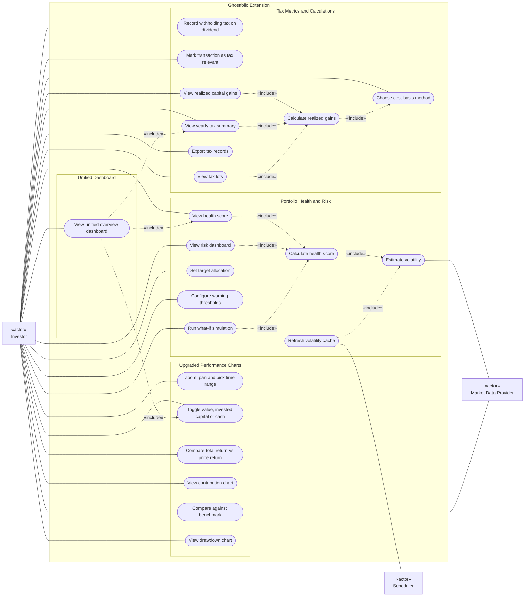
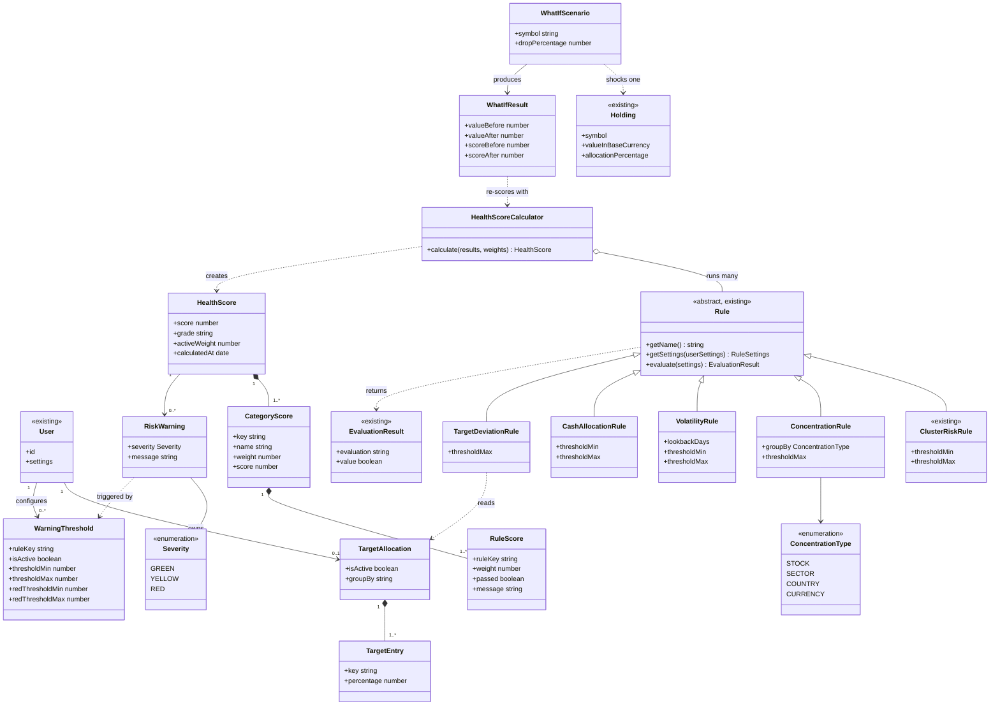
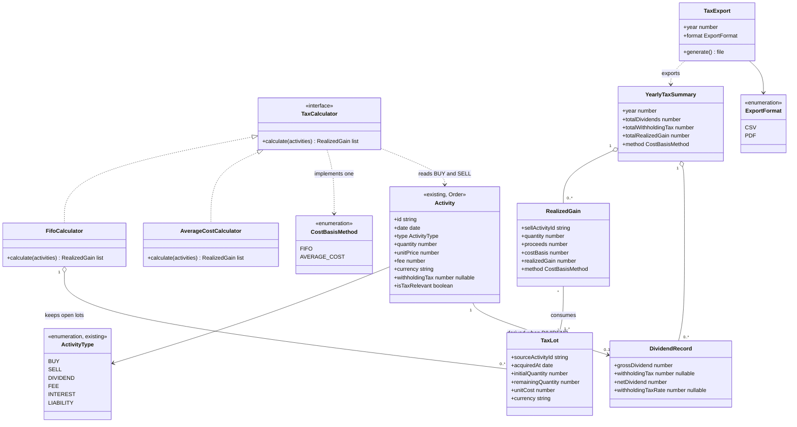
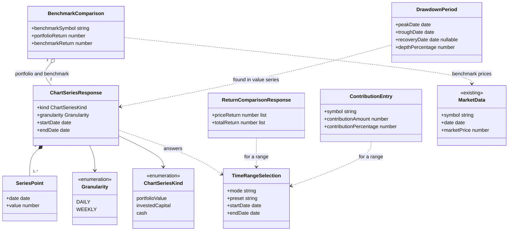
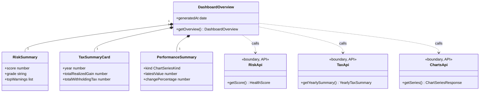

# UML Diagrams — Proposed Ghostfolio Features

**Author:** sesha siva sankar (member 1)
**Date:** Sun, Sep 20
**Scope:** use case, class and activity diagrams for the proposed features (risk, tax, charts) plus the unified dashboard

---

## 0. How I built these

Followed the requirements engineering lecture (Module 2.2) step by step:

- **Step 1 — actors:** who or what talks to the system from the outside.
- **Step 2 — use cases:** what each actor gets out of the system (use case diagram).
- **Step 3 — object model:** the domain classes, attributes and links between them (class diagram).
- **Step 4 — behavior:** the flow of one scenario from start to end (activity diagram).

Things I lined up with the team's docs so we don't contradict each other:

- Tharun's `withholdingTax` field on dividend activities and his FIFO working-lot fields.
- Arthur's `TimeRangeSelection` and `ChartSeriesResponse` types.
- Raniya's rule that the dashboard only calls the risk, tax and charts modules through their APIs, never their services.
- My own docs 02 to 05 for the health score, concentration, volatility, cash and target-deviation logic.

Diagrams are Mermaid, so GitHub renders them straight from this file. Mermaid has no stick figures, so actors show as boxes tagged «actor».

---

## 1. Actors

- **Investor** — the human user. Views scores, charts and tax numbers, and sets preferences.
- **Market Data Provider** — external system (Yahoo, CoinGecko and so on). Supplies price history and benchmark prices.
- **Scheduler** — system actor. Runs the nightly job that refreshes the cached volatility numbers (the lecture asks "are there scheduled processes?", and there is one).

---

## 2. Use case diagram

- One box for the whole extension, split into four groups.
- Dotted arrows are «include» (the use case always calls the other one).
- Investor is the main actor; the other two only touch the data-heavy use cases.

Reading notes:

- **Risk:** "View health score", "View risk dashboard" and "Run what-if simulation" all need a fresh score, so each includes "Calculate health score". That in turn includes "Estimate volatility", which is the only place the Market Data Provider is needed.
- **Tax:** every number the investor sees (gains, lots, yearly summary) goes through "Calculate realized gains", which always uses the chosen cost-basis method (FIFO or average cost).
- **Charts:** these stay simple. The one outside dependency is the benchmark prices.
- **Dashboard:** it does not calculate anything itself. It pulls the health score, yearly tax summary and the value chart from the three feature APIs.

---

## 3. Class diagrams (analysis object model)

- Domain-level classes only, the way the lecture describes it: user-level concepts, not final code classes.
- Existing Ghostfolio classes are tagged `«existing»`. Everything else is new.
- Split into four diagrams (one per feature) so each one stays readable.

### 3.1 Risk

Reuses Ghostfolio's existing abstract `Rule` (every X-Ray check already extends it), so the new checks are just new subclasses. That's the generalization and abstraction idea from the lecture.

- `HealthScore` is composed of `CategoryScore`, which is composed of `RuleScore`. They have no life outside the score, so I used composition (filled diamond).
- `HealthScoreCalculator` only aggregates rules (empty diamond). The rules exist on their own.
- `TargetDeviationRule` is the only rule that depends on user input (`TargetAllocation`). If the user never set a target, that rule simply doesn't run.

### 3.2 Tax

Mostly new classes on top of Ghostfolio's existing activity (stored as `Order` in Prisma). The one new stored field is Tharun's `withholdingTax`.

- `TaxCalculator` is an interface with two implementations. The investor picks one, and everything downstream (summary, export) doesn't care which one ran.
- `withholdingTax` is nullable on purpose (Tharun's rule): null means unknown, zero means known and nothing was withheld. `DividendRecord` keeps that difference, so the yearly summary never treats "unknown" as zero.
- `isTaxRelevant` matches Tharun's confirmed Sep 23 field exactly: a non-nullable boolean, defaulting to true, on the activity.

### 3.3 Charts

Uses Arthur's `TimeRangeSelection` and `ChartSeriesResponse` as written in his zoom/pan spec. The other classes follow his Sep 17 to Sep 23 tasks.

- Zoom and pan never create a new concept. Both just become a `custom` `TimeRangeSelection` (Arthur's design), so the backend has one simple contract.
- Granularity comes back with the data (daily up to 2 years, weekly beyond that), so the chart knows how to space the x-axis.
- `kind` (`ChartSeriesKind`, per Arthur's confirmed design) tags a `ChartSeriesResponse` so the frontend can label the axis without guessing which of value, invested capital or cash it's looking at.
- Total return and price return are not a toggle. `ReturnComparisonResponse` returns both as aligned, indexed series in one response, so the chart draws both lines at once and the gap between them is the point of the feature.

### 3.4 Unified dashboard

Only aggregates. It holds small summaries of the three features and never reaches into their services.

- The three `«boundary, API»` classes are the public controllers of each feature module. That is exactly Raniya's access rule: the dashboard is just another client of those APIs.
- Each summary is a small slice of a bigger object (for example `RiskSummary` is a slice of `HealthScore`), so the dashboard stays light.

---

## 4. Activity diagrams

- Notation from the lecture: filled circle is start, ringed circle is end, rounded box is an action, diamond is a decision or merge, thick bar is fork or join.
- One diagram per feature, each for its most important scenario.

### 4.1 Risk — calculate the health score

```mermaid
flowchart TD
    s(( )):::start --> a1["Load open holdings, accounts and user settings"]
    a1 --> d1{"Any open holdings?"}
    d1 -- "No" --> a2["Leave out holding-based categories"]
    d1 -- "Yes" --> a3["Keep all categories"]
    a2 --> m1(("merge"))
    a3 --> m1
    m1 --> a4["Build the rule list for each category"]
    a4 --> f1["fork"]:::bar

    f1 --> b1["Run existing X-Ray rules"]
    f1 --> b2["Run concentration rules for stock, sector, country and currency"]
    f1 --> b3["Read cached volatility and check the band"]
    f1 --> b4["Check cash allocation, and target deviation only if a target is set"]

    b1 --> j1["join"]:::bar
    b2 --> j1
    b3 --> j1
    b4 --> j1

    j1 --> a5["Drop rules the user turned off"]
    a5 --> d2{"Any active rules left?"}
    d2 -- "No" --> a6["Return score = null with a reason"]
    a6 --> e1(((" "))):::endNode
    d2 -- "Yes" --> a7["Score = passed weight / active weight x 100"]
    a7 --> a8["Work out each category sub-score"]
    a8 --> a9["Map results to green, yellow or red with the user thresholds"]
    a9 --> a10["Create a warning for every breached threshold"]
    a10 --> a11["Return HealthScore to the dashboard"]
    a11 --> e2(((" "))):::endNode

    classDef start fill:#000,stroke:#000
    classDef endNode fill:#fff,stroke:#000,stroke-width:3px
    classDef bar fill:#000,stroke:#000,color:#fff
```

- The four rule groups are independent, so they can run in parallel (fork and join).
- The "no active rules" exit matters: a user who turned everything off gets `null`, not a fake 100.

### 4.2 Risk — run a what-if simulation

```mermaid
flowchart TD
    s(( )):::start --> a1["Investor picks a holding and a drop percentage"]
    a1 --> d1{"Holding exists and 0 < drop <= 100?"}
    d1 -- "No" --> a2["Show a validation error"]
    a2 --> a1
    d1 -- "Yes" --> a3["Copy the current holdings, real data is never changed"]
    a3 --> a4["Reduce that holding's value by the drop percentage"]
    a4 --> a5["Recalculate total portfolio value"]
    a5 --> a6["Re-run the health score on the copied holdings"]
    a6 --> a7["Compare with the real portfolio: value change, score change, new warnings"]
    a7 --> a8["Show the result"]
    a8 --> d2{"Try another scenario?"}
    d2 -- "Yes" --> a1
    d2 -- "No" --> e1(((" "))):::endNode

    classDef start fill:#000,stroke:#000
    classDef endNode fill:#fff,stroke:#000,stroke-width:3px
```

### 4.3 Tax — calculate realized gains and export

```mermaid
flowchart TD
    s(( )):::start --> a1["Investor picks a tax year and a cost-basis method"]
    a1 --> a2["Load BUY, SELL and DIVIDEND activities marked tax relevant"]
    a2 --> a3["Group activities by asset"]
    a3 --> d1{"Which method?"}
    d1 -- "FIFO" --> a4["Match each SELL against the oldest open lots"]
    d1 -- "Average cost" --> a5["Match each SELL at the running average cost"]
    a4 --> m1(("merge"))
    a5 --> m1
    m1 --> a6["Compute realized gain for every SELL"]
    a6 --> a7["Add dividends and withholding tax, unknown withholding stays unknown"]
    a7 --> a8["Build the yearly tax summary"]
    a8 --> a9["Show summary, gains and tax lots"]
    a9 --> d2{"Export?"}
    d2 -- "No" --> e1(((" "))):::endNode
    d2 -- "Yes" --> d3{"Format?"}
    d3 -- "CSV" --> a10["Generate CSV file"]
    d3 -- "PDF" --> a11["Generate PDF file"]
    a10 --> a12["Download the file"]
    a11 --> a12
    a12 --> e2(((" "))):::endNode

    classDef start fill:#000,stroke:#000
    classDef endNode fill:#fff,stroke:#000,stroke-width:3px
```

### 4.4 Charts — interact with the performance chart

```mermaid
flowchart TD
    s(( )):::start --> a1["Open the chart with the default preset range"]
    a1 --> a2["Request the series from the charts API"]
    a2 --> a3["Backend picks granularity from the range width: daily up to 2 years, weekly beyond"]
    a3 --> a4["Return ChartSeriesResponse"]
    a4 --> a5["Redraw the chart"]
    a5 --> d1{"What does the investor do?"}

    d1 -- "Zoom or pan" --> b1["Turn the new window into a custom TimeRangeSelection"]
    d1 -- "Pick a preset" --> b2["Build a preset TimeRangeSelection"]
    d1 -- "Toggle value, invested capital or cash" --> b3["Change the selected series type"]
    d1 -- "Switch total vs price return" --> b4["Change the return type"]
    d1 -- "Leave the page" --> e1(((" "))):::endNode

    b1 --> m1(("merge"))
    b2 --> m1
    b3 --> m1
    b4 --> m1
    m1 --> a2

    classDef start fill:#000,stroke:#000
    classDef endNode fill:#fff,stroke:#000,stroke-width:3px
```

- This one is a loop by design: every interaction ends up as a new request with a new selection, then a redraw.

---

## 5. Things to double check before this goes in the report

- **Names owned by teammates, now confirmed:** `isTaxRelevant` matches Tharun's Sep 23 doc exactly. Arthur's real names differ from my first guess: it's `ChartSeriesKind` (a lowercase string union: `portfolioValue`, `investedCapital`, `cash`), not `SeriesType`/`PORTFOLIO_VALUE`; and there is no `ReturnType` toggle at all — total return and price return come back together as one `ReturnComparisonResponse`, since the feature's value is seeing both lines at once. The diagrams above have been corrected to match.
- **Composite score endpoint:** the iteration plan has no build slot for `HealthScoreCalculator` in Iteration 2, so it should become its own backlog issue.
- **Rendering:** the diagrams render on GitHub. For the PDF report, paste each block into mermaid.live and export as PNG or SVG.
