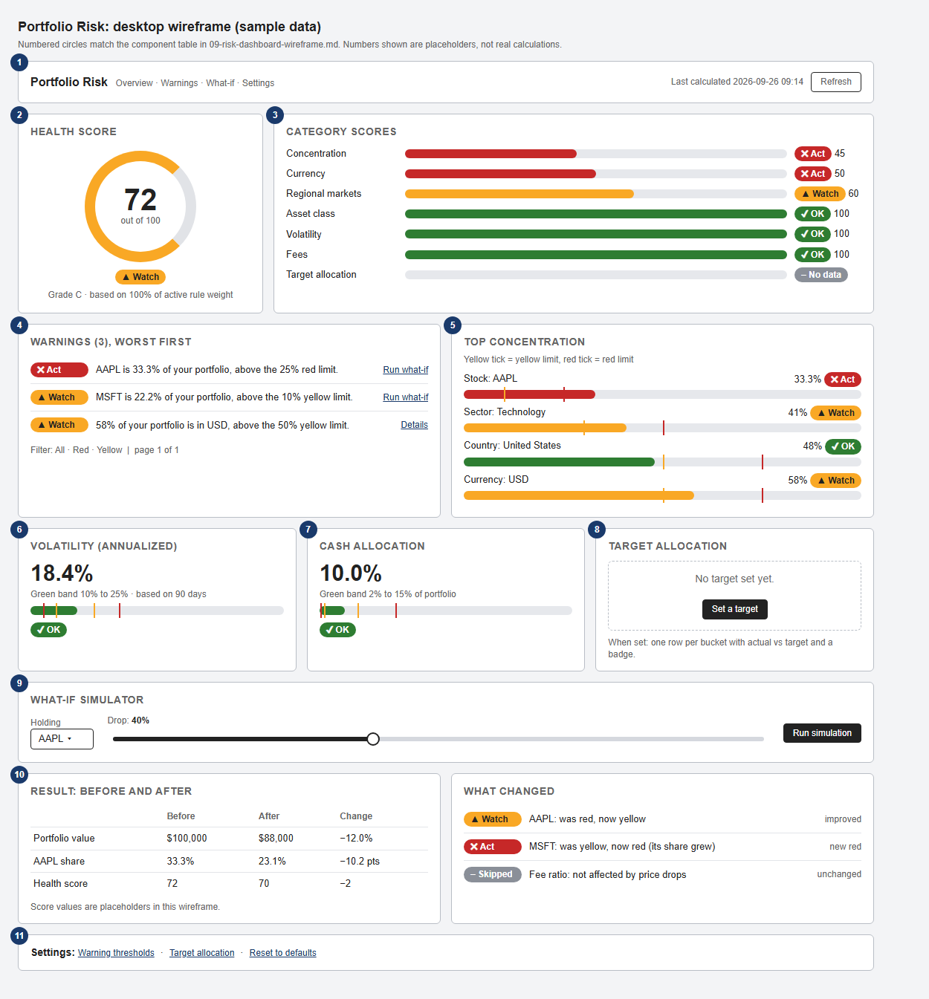

# Risk Dashboard — Wireframe

**Author:** sesha siva sankar (member 1)
**Task date:** Thu, Sep 24

**Task:** Wireframe risk dashboard (red/yellow/green indicators)

---

## 1. What this page is

- The full "Portfolio Risk" page for the investor. Raniya's Unified Dashboard only shows a small risk card (health score and top concentration risk). This page is what that card opens.
- It answers four questions, top to bottom:
  - How healthy is my portfolio overall? (score and categories)
  - What exactly is wrong? (warnings and concentration)
  - Are my "numbers I can't see" fine? (volatility, cash, target)
  - What happens if something falls? (what-if)

## 2. The wireframe

- The picture uses sample numbers, and they are placeholders, not real calculations.
- The source is `images/risk-dashboard-wireframe.html`. Change it and re-take the screenshot if the layout needs to move.

## 3. Design rules I followed

- **Never color alone.** Every severity is a color plus an icon plus a word: `✔ OK`, `▲ Watch`, `✖ Act`, and `– No data`. A color-blind user (or a black and white printout in the report) still reads it correctly.
- **Every number has a field behind it.** Same discipline as Raniya's dashboard wireframe: nothing on screen without a backing API field, and no API field without a place on screen.
- **Worst first.** Warnings and categories sort by severity so the first thing seen is the thing to fix.
- **One component for severity.** All three levels use the same badge, so a color change is a one-line edit.

## 4. Components and where their data comes from

Endpoints are defined in `10-risk-api-contract.md` (Friday's task). All paths start with `/api/v1/risk`.

| #   | Component              | What it shows                                                                | Data (endpoint → field)                                                                  |
| --- | ---------------------- | ---------------------------------------------------------------------------- | ---------------------------------------------------------------------------------------- |
| 1   | Page header            | Title, last calculated time, refresh button                                  | `GET /score` → `calculatedAt`                                                            |
| 2   | Health score gauge     | Big number, ring, severity badge, grade, how much weight was counted         | `GET /score` → `score`, `severity`, `grade`, `activeWeight`                              |
| 3   | Category score bars    | One bar per category with score and badge                                    | `GET /score` → `categories[].name`, `.score`, `.severity`                                |
| 4   | Warning list           | Worst-first list, each with a message and a "Run what-if" link               | `GET /warnings` → `data[].severity`, `.message`, `.subject`                              |
| 5   | Top concentration bars | Stock, sector, country and currency, each with its yellow and red tick marks | `GET /concentration` → `stock[]`, `sector[]`, `country[]`, `currency[]`, `thresholds`    |
| 6   | Volatility card        | Annualized number, green band, days of history                               | `GET /score` → rule `PortfolioVolatility`: `actual`, `thresholds`, `details.historyDays` |
| 7   | Cash allocation card   | Cash share, green band                                                       | `GET /score` → rule `CashAllocation`: `actual`, `thresholds`                             |
| 8   | Target allocation card | Actual vs target per bucket, or an empty state with a "Set a target" button  | `GET /target-allocation` → `targets[]`, `buckets[]`                                      |
| 9   | What-if controls       | Holding picker, drop slider, run button                                      | Holdings list: existing `GET /api/v1/portfolio/holdings`. Submit: `POST /what-if`        |
| 10  | What-if result         | Before and after table, and the list of what changed                         | `POST /what-if` → `portfolio`, `holding`, `score`, `ruleChanges`, `newWarnings`          |
| 11  | Settings links         | Opens the threshold form and the target form                                 | `GET/PUT /thresholds`, `GET/PUT/DELETE /target-allocation`                               |

Two design notes on that table:

- Volatility and cash come from the `rules` inside `/score`, not from their own endpoints. The score already has to compute them, so a second endpoint would just repeat the same work.
- The holdings list for the what-if picker already exists in Ghostfolio, so I'm reusing it instead of adding a risk-specific one.

## 5. Screen states

Every card needs to handle these, not only the happy path.

| Situation                     | What the user sees                                                                                                    |
| ----------------------------- | --------------------------------------------------------------------------------------------------------------------- |
| Loading                       | Gray placeholder blocks in the same layout (no spinner-only page)                                                     |
| Empty portfolio (no holdings) | One friendly message and a link to add an activity. Holding-based cards are hidden; cash card still shows             |
| No active rules               | Score card shows "No score" with the reason from the API, not a fake 100                                              |
| No target set                 | Card 8 shows the dashed empty state with "Set a target" (already in the wireframe)                                    |
| `NO_DATA` on a rule           | Gray `– No data` badge and a one-line reason (for example "needs about 20 days of price history")                     |
| Restricted view               | Percentages and severities visible, money amounts hidden (same as the rest of Ghostfolio)                             |
| Basic subscription            | Same gating as today's X-Ray page. The exact behavior is an open question, see the API contract                       |
| API error                     | Card-level error with the message from the API's `error.message` and a retry button, the rest of the page still works |

## 6. Interaction notes

- **Refresh:** re-fetches `/score` and `/warnings`. It doesn't recalculate volatility (that is a nightly job).
- **"Run what-if" on a warning:** jumps to card 9 with that holding already selected, so the flow is warning to simulation in one click.
- **Slider:** 1% to 100% in 1% steps. The value is sent as a decimal (`40` on screen becomes `0.40` in the request).
- **Run simulation:** only runs when the button is pressed, not on every slider move, so the slider stays smooth.
- **What-if results are not saved.** Leaving the page clears them.
- **Threshold form (opens from card 11):**
  - One row per rule: on/off switch, yellow limit, red limit (and a min/max pair for the two band checks).
  - Validation messages appear beside the field, using the ordering rules from the Sep 22 doc.
  - "Reset to defaults" clears all overrides.
- **Target form:** pick what to group by (asset class, sector, country, currency or symbol), enter a percentage per bucket, and show a running total. Save is disabled until the total is exactly 100%.

## 7. Design tokens

| Level   | Color     | Text color | Icon | Word    |
| ------- | --------- | ---------- | ---- | ------- |
| GREEN   | `#2E7D32` | white      | ✔    | OK      |
| YELLOW  | `#F9A825` | `#222222`  | ▲    | Watch   |
| RED     | `#C62828` | white      | ✖    | Act     |
| NO_DATA | `#8A8F98` | white      | –    | No data |

- Yellow uses dark text because white on yellow is hard to read.
- These should live as shared design tokens in Raniya's component library, not be hardcoded inside the risk page.

## 8. React components

Raniya owns the shared library and each feature owner builds their own feature's components. Proposed split:

| Component                        | Owner           | Notes                                                                                                           |
| -------------------------------- | --------------- | --------------------------------------------------------------------------------------------------------------- |
| `SeverityBadge`                  | shared (Raniya) | Also needed by her dashboard risk card, so it belongs in the shared library. Request for Raniya, see section 10 |
| `BandMeter` (bar with ticks)     | shared (Raniya) | Used for concentration, volatility and cash. Charts may reuse it                                                |
| `RiskScoreGauge`                 | risk (Sesha)    | Card 2                                                                                                          |
| `CategoryScoreBar`               | risk (Sesha)    | Card 3                                                                                                          |
| `WarningList`                    | risk (Sesha)    | Card 4                                                                                                          |
| `ConcentrationPanel`             | risk (Sesha)    | Card 5, built on `BandMeter`                                                                                    |
| `MetricCard`                     | risk (Sesha)    | Cards 6 and 7                                                                                                   |
| `TargetAllocationCard`           | risk (Sesha)    | Card 8                                                                                                          |
| `WhatIfPanel` and `WhatIfResult` | risk (Sesha)    | Cards 9 and 10                                                                                                  |
| `ThresholdSettingsForm`          | risk (Sesha)    | Card 11                                                                                                         |

## 9. Smaller screens

- Below about 900 px, cards stack in this order: score, warnings, category scores, concentration, volatility, cash, target, what-if.
- Warnings come second on purpose: on a phone the first thing to see after the score is what to act on.
- The three small cards (6, 7, 8) become full width.

## 10. How this connects to Raniya's dashboard

- Her risk card shows `risk.healthScore` and `risk.topConcentrationRisk`.
- I'm asking to add the severity badge to that card, backed by the `severity` field the summary endpoint returns.
- Clicking her risk card opens this page.

## 11. Not covered here

- Pixel-level visual design, spacing and typography (this is a layout wireframe).
- Dark mode.
- The exact look of the two settings forms (described above in words only).
